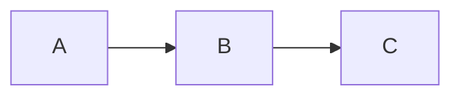

# Documentação do Sistema Pint of Science Brasil

Esta pasta contém a documentação completa do usuário do Sistema de Certificados Pint of Science Brasil, construída com **MkDocs Material**.

## 📚 Estrutura

```
docs-manual/
├── index.md                      # Página inicial
├── guia-rapido.md               # Guia rápido de uso
├── sobre-sistema.md             # Sobre o sistema
├── solucao-problemas.md         # Solução de problemas
├── suporte.md                   # Contato e suporte
├── images/                      # Imagens usadas na documentação
│   ├── pint_logo.png
│   ├── pint_signature.png
│   └── sponsor_logo.png
├── participantes/               # Documentação para participantes
│   ├── index.md
│   ├── como-se-inscrever.md
│   ├── baixar-certificado.md
│   ├── validar-certificado.md
│   └── faq.md
├── coordenadores/               # Documentação para coordenadores
│   ├── index.md
│   ├── acesso-sistema.md
│   ├── validar-participantes.md
│   ├── gerenciar-participantes.md
│   ├── enviar-certificados.md
│   └── relatorios.md
├── administradores/             # Documentação para administradores
│   ├── index.md
│   ├── gestao-coordenadores.md
│   ├── gestao-cidades.md
│   ├── gestao-eventos.md
│   ├── gestao-funcoes.md
│   └── auditoria.md
└── configuracao/                # Configuração do sistema
    ├── index.md
    ├── imagens-certificado.md
    ├── carga-horaria.md
    ├── cores-fontes.md
    └── avancadas.md
```

## 🚀 Como Usar

### Pré-requisitos

Instale as dependências (já estão no requirements.txt):

```bash
pip install mkdocs-material mkdocs-with-pdf
```

Ou com uv:

```bash
uv pip install mkdocs-material mkdocs-with-pdf
```

### Visualizar Localmente

Para visualizar a documentação em tempo real:

```bash
mkdocs serve
```

Depois acesse: http://localhost:8000

### Construir Site Estático

Para gerar os arquivos HTML:

```bash
mkdocs build
```

Os arquivos serão gerados em `site/`

### Gerar PDF

Para gerar o PDF do manual:

```bash
ENABLE_PDF_EXPORT=1 mkdocs build
```

O PDF será gerado em: `site/pdf/manual-usuario-pint-of-science.pdf`

## 🖼️ Adicionando Imagens

### Imagens na Documentação

Todas as imagens devem estar na pasta `docs-manual/images/`:

```bash
# Copiar imagens do projeto
cp static/2025/*.png docs-manual/images/

# Adicionar novas imagens
cp minha-screenshot.png docs-manual/images/
```

### Referenciando Imagens no Markdown

Use caminhos relativos ao arquivo `.md`:

```markdown
# Na raiz (ex: index.md)


# Em subpasta (ex: participantes/faq.md)


```

### Dicas de Imagens

- ✅ Use formatos PNG ou JPG
- ✅ Otimize tamanho (<500KB idealmente)
- ✅ Use nomes descritivos (sem espaços)
- ✅ Adicione texto alternativo (alt text)

## Conteúdo da Documentação

### Para Participantes

- Como se inscrever no sistema
- Como baixar certificados
- Como validar autenticidade
- Perguntas frequentes

### Para Coordenadores

- Acesso e login ao sistema
- Validação de participantes
- Gerenciamento de dados
- Envio de certificados por e-mail
- Relatórios e estatísticas

### Para Administradores

- Gestão de coordenadores
- Gestão de cidades e eventos
- Gestão de funções
- Configurações visuais
- Configuração de carga horária
- Logs de auditoria

### Configuração do Sistema

- Upload de imagens para certificados
- Personalização de cores
- Configuração de carga horária
- Configurações avançadas

## 🎨 Personalização

### Temas e Cores

Edite `mkdocs.yml` para alterar cores:

```yaml
theme:
  palette:
    primary: deep orange # Cor primária
    accent: pink # Cor de destaque
```

### Logo e Favicon

Para adicionar logo personalizado:

```yaml
theme:
  logo: assets/logo.png
  favicon: assets/favicon.png
```

## 📝 Adicionando Conteúdo

### Criar Nova Página

1. Crie um arquivo `.md` na pasta apropriada
2. Adicione ao `nav` no `mkdocs.yml`
3. Use Markdown padrão + extensões do Material

### Markdown Extensions Disponíveis

- **Admonitions**: Blocos de aviso/nota/dica
- **Code blocks**: Blocos de código com highlight
- **Tables**: Tabelas Markdown
- **Mermaid**: Diagramas
- **Emoji**: Emojis `:smile:`
- **Tabs**: Conteúdo em abas

#### Exemplos:

**Admonitions:**

```markdown
!!! note "Nota"

    Conteúdo da nota

!!! warning "Atenção"

    Conteúdo do aviso

!!! tip "Dica"

    Conteúdo da dica
```

**Code blocks:**

````markdown
```python
def hello():
    print("Hello!")
```
````

**Tabs:**

```markdown
=== "Tab 1"
Conteúdo da tab 1

=== "Tab 2"
Conteúdo da tab 2
```

**Mermaid:**

````markdown

````

## 🚀 Deploy

### GitHub Pages

```bash
mkdocs gh-deploy
```

### Servidor Web

Após `mkdocs build`, copie a pasta `site/` para seu servidor:

```bash
rsync -av site/ usuario@servidor:/var/www/docs/
```

### Docker (Opcional)

```dockerfile
FROM squidfunk/mkdocs-material
COPY . /docs
```

## 📊 Estatísticas

- **Páginas criadas**: 15+ páginas
- **Seções**: 4 seções principais
- **Idioma**: Português (pt-BR)
- **Framework**: MkDocs Material
- **PDF**: Suporte completo

## 🔧 Manutenção

### Atualizar Dependências

```bash
pip install --upgrade mkdocs-material mkdocs-with-pdf
```

### Verificar Links Quebrados

```bash
mkdocs build --strict
```

### Limpar Build

```bash
rm -rf site/
```

## 📚 Recursos

- [MkDocs Documentation](https://www.mkdocs.org/)
- [Material for MkDocs](https://squidfunk.github.io/mkdocs-material/)
- [MkDocs PDF Export](https://github.com/orzih/mkdocs-with-pdf)

## 🤝 Contribuindo

Para adicionar ou melhorar a documentação:

1. Edite os arquivos `.md` apropriados
2. Teste localmente com `mkdocs serve`
3. Verifique o PDF (se aplicável)
4. Commit e push

## ❓ Dúvidas

Se tiver dúvidas sobre a documentação, entre em contato através dos canais de suporte descritos em `suporte.md`.

---

**Última atualização**: 2025-10-15
