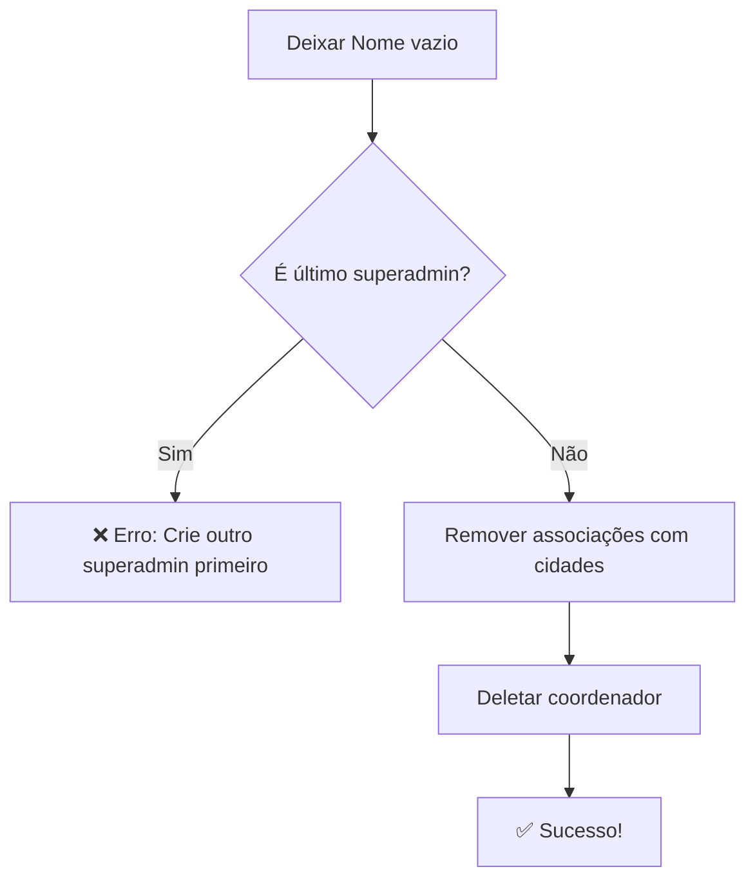

# Gestão de Coordenadores

Guia completo para criar, editar e gerenciar coordenadores de cidades no Sistema Pint of Science Brasil.

## 🎯 O que são Coordenadores?

Coordenadores são usuários que têm permissão para:

- ✅ Validar participantes das cidades associadas
- ✅ Visualizar e editar dados de participantes
- ✅ Enviar certificados por e-mail
- ✅ Gerar relatórios de sua(s) cidade(s)

!!! info "Permissões Limitadas"

    Diferente de superadmins, coordenadores **só veem e gerenciam participantes das cidades a que foram associados**.

## 🚀 Acessando a Gestão

1. Faça login como superadmin
2. Acesse **⚙️ Administração** no menu lateral
3. Clique na aba **👤 Coordenadores**

Você verá duas seções principais:

- **Criar Novo Coordenador** (formulário)
- **Coordenadores Cadastrados** (tabela editável)
- **Associações Coordenador-Cidade** (gestão de permissões)

## ➕ Criando Novo Coordenador

### Passo a Passo

1. Preencha o formulário "Criar Novo Coordenador":

   - **Nome**: Nome completo do coordenador
   - **E-mail**: E-mail válido (será usado para login)
   - **Senha**: Senha inicial (min. 6 caracteres)
   - **É Superadmin?**: Marque apenas se for administrador total

2. Clique em **"👤 Criar Coordenador"**

3. Se bem-sucedido, aparecerá um **modal para associar cidades**:

   - Selecione uma ou mais cidades no multiselect
   - Clique em **"💾 Salvar Associações"**
   - Ou pule esta etapa e associe depois

!!! tip "Dica"

    Você pode associar cidades depois usando a seção "Associações Coordenador-Cidade" mais abaixo na página.

### Campos Obrigatórios

| Campo          | Tipo     | Validação             | Observação                           |
| -------------- | -------- | --------------------- | ------------------------------------ |
| **Nome**       | Texto    | Obrigatório           | Nome completo do usuário             |
| **E-mail**     | E-mail   | Formato válido, único | Usado como username para login       |
| **Senha**      | Texto    | Min. 6 caracteres     | Recomendado trocar no primeiro login |
| **Superadmin** | Checkbox | Opcional              | Dá acesso total ao sistema           |

### Exemplo de Criação

```
Nome: Maria Silva Santos
E-mail: maria.silva@exemplo.com.br
Senha: MariaSilva2025!
É Superadmin?: ☐ (não marcado)

Cidades associadas (modal):
✓ Brasília-DF
✓ Goiânia-GO
```

Resultado: Maria poderá validar participantes apenas de Brasília e Goiânia.

## 📝 Editando Coordenadores Existentes

### Usando o Data Editor

A lista de coordenadores usa um **data_editor** interativo:

1. **Localize o coordenador** na tabela
2. **Clique duplo** na célula que deseja editar
3. **Modifique o valor**
4. Clique em **"💾 Salvar Alterações"**

### Campos Editáveis

| Campo          | Editável? | Como Editar                                   |
| -------------- | --------- | --------------------------------------------- |
| **ID**         | ❌ Não    | Somente leitura                               |
| **Nome**       | ✅ Sim    | Clique duplo na célula                        |
| **E-mail**     | ✅ Sim    | Clique duplo na célula                        |
| **Senha**      | ✅ Sim    | Digite nova senha (será hash automaticamente) |
| **Superadmin** | ✅ Sim    | Marque/desmarque checkbox                     |
| **Cidades**    | ❌ Não    | Use seção "Associações" abaixo                |

### Alterando Nome

```
Antes: João Pedro Oliveira
Depois: João Pedro Oliveira Silva
```

Clique duplo → Digite → Salvar

### Alterando E-mail

```
Antes: joao@antigo.com
Depois: joao.pedro@novo.com.br
```

!!! warning "Atenção"

    Alterar o e-mail muda o **username de login**. Informe o coordenador sobre a mudança!

### Alterando Senha

```
Nova senha: NovaSenhaSegura2025!
```

!!! info "Segurança"

    A senha é automaticamente convertida em hash bcrypt antes de ser salva. Nunca é armazenada em texto puro.

### Tornando Superadmin

Para promover um coordenador a superadmin:

1. Localize a linha do coordenador
2. Marque a checkbox na coluna **"Superadmin"**
3. Clique em **"💾 Salvar Alterações"**

!!! danger "Cuidado"

    Superadmins têm **acesso total** ao sistema, incluindo outros coordenadores, configurações e auditoria.

## 🗑️ Deletando Coordenadores

### Como Deletar

Para deletar um coordenador:

1. Localize a linha do coordenador
2. **Deixe o campo "Nome" vazio** (delete todo o texto)
3. Clique em **"💾 Salvar Alterações"**
4. Confirme a ação

### Regras de Proteção

O sistema **NÃO permite** deletar coordenador se:

❌ **É o último superadmin do sistema**

- Deve existir pelo menos 1 superadmin sempre
- Crie outro superadmin antes de deletar

✅ **Tem cidades associadas**

- Sistema remove associações automaticamente
- Depois deleta o coordenador

### Processo de Deleção



### Exemplo de Erro

```
❌ Não é possível deletar João Silva: é o único superadmin
do sistema. Crie outro superadmin antes de deletar este.
```

**Solução**:

1. Promova outro coordenador a superadmin
2. Depois delete João Silva

## 🏙️ Associando Coordenadores às Cidades

### Por que Associar?

Coordenadores **só veem participantes das cidades associadas**. Isso garante:

- ✅ Segurança dos dados (cada coordenador vê apenas sua região)
- ✅ Organização clara de responsabilidades
- ✅ Facilidade de filtros e relatórios

### Seção "Associações Coordenador-Cidade"

Na parte inferior da aba Coordenadores, você encontra a gestão de associações.

#### Passo a Passo

1. **Selecione um coordenador** no dropdown
2. **Veja as cidades já associadas** (lista atual)
3. **Selecione novas cidades** no multiselect
4. Clique em **"💾 Associar Cidades"**

### Exemplo de Associação

```
Coordenador: Maria Silva Santos
Cidades atuais: Brasília-DF

Adicionar: ✓ Goiânia-GO
           ✓ Palmas-TO

Resultado: Maria verá participantes de Brasília, Goiânia e Palmas
```

### Removendo Associações

Para remover uma cidade:

1. Selecione o coordenador
2. **Desmarque a cidade** no multiselect
3. Clique em **"💾 Associar Cidades"**

O sistema substitui associações antigas pelas novas selecionadas.

### Coordenadores Superadmin

!!! info "Superadmins Veem Tudo"

    Coordenadores com flag **superadmin** marcado **veem participantes de TODAS as cidades**, independente de associações.

## 🔍 Visualizando Informações

### Tabela de Coordenadores

A tabela mostra:

| Coluna                 | Descrição                                    |
| ---------------------- | -------------------------------------------- |
| **ID**                 | Identificador único                          |
| **Nome**               | Nome completo                                |
| **E-mail**             | E-mail de login                              |
| **Senha**              | Hash bcrypt (não é visível)                  |
| **Superadmin**         | ✓ se for superadmin                          |
| **Cidades Associadas** | Lista de cidades separadas por vírgula       |
| **Data Criação**       | Quando foi criado (formato DD/MM/YYYY HH:MM) |

### Exemplo de Linha

```
ID: 3
Nome: Carlos Alberto Costa
E-mail: carlos.costa@exemplo.com
Senha: (hash oculto)
Superadmin: ☐
Cidades: Curitiba-PR, Londrina-PR, Maringá-PR
Data Criação: 15/01/2025 10:30
```

### Ordenação

- Por padrão, coordenadores são ordenados por **ID crescente**
- Você pode clicar nos cabeçalhos das colunas para ordenar

## 📧 Comunicando Credenciais

### O que Informar ao Novo Coordenador

Após criar um coordenador, envie as seguintes informações:

```
Olá [Nome],

Sua conta no Sistema Pint of Science Brasil foi criada!

🔐 CREDENCIAIS DE ACESSO:
- URL: [URL do sistema]
- E-mail: [email@exemplo.com]
- Senha inicial: [senha_temporaria]

🏙️ CIDADES SOB SUA RESPONSABILIDADE:
- [Cidade 1 - Estado]
- [Cidade 2 - Estado]

📚 RECOMENDAÇÕES:
1. Faça login no sistema
2. Troque sua senha no primeiro acesso
3. Consulte a documentação para coordenadores
4. Entre em contato se tiver dúvidas

Atenciosamente,
Equipe Pint of Science Brasil
```

!!! warning "Segurança"

    Envie credenciais por canal seguro (e-mail criptografado, mensagem direta). **Nunca por redes sociais públicas**.

## 🛠️ Casos de Uso Comuns

### Caso 1: Novo Coordenador para Cidade Existente

```
Situação: Nova pessoa assumiu coordenação de Florianópolis

Ação:
1. Criar coordenador: Ana Paula Rodrigues
2. Associar cidade: Florianópolis-SC
3. Enviar credenciais por e-mail
4. Remover coordenador antigo (se não for mais usar)
```

### Caso 2: Coordenador Gerencia Múltiplas Cidades

```
Situação: Pedro gerencia 3 cidades no mesmo estado

Ação:
1. Criar coordenador: Pedro Henrique Santos
2. Associar cidades:
   - Vitória-ES
   - Vila Velha-ES
   - Serra-ES
3. Enviar credenciais com lista de cidades
```

### Caso 3: Promover Coordenador a Superadmin

```
Situação: Maria vai ajudar na administração geral

Ação:
1. Localizar Maria Silva na tabela
2. Marcar checkbox "Superadmin"
3. Salvar alterações
4. Notificar Maria sobre novos privilégios
5. Orientar sobre responsabilidades
```

### Caso 4: Coordenador Esqueceu a Senha

```
Situação: João não lembra senha de acesso

Ação:
1. Localizar João Pedro na tabela
2. Digitar nova senha temporária na célula "Senha"
3. Salvar alterações
4. Enviar nova senha por e-mail
5. Pedir para trocar no primeiro login
```

### Caso 5: Trocar Coordenador de Cidade

```
Situação: Carlos sai, Lucas entra na coordenação de Curitiba

Ação:
1. Criar coordenador: Lucas Ferreira
2. Associar cidade: Curitiba-PR
3. Remover associação de Carlos com Curitiba
   (ou deletar Carlos se não coordena outras cidades)
4. Notificar ambos sobre mudança
```

## 🔒 Segurança e Auditoria

### Registro de Ações

Todas as ações em coordenadores são registradas:

- ✅ Criação de coordenador
- ✅ Edição de dados
- ✅ Mudança de senha
- ✅ Associação/desassociação de cidades
- ✅ Deleção de coordenador

Acesse os logs na aba **"📊 Auditoria"**.

### Boas Práticas de Segurança

1. **Senhas fortes**: Mínimo 8 caracteres, letras + números + símbolos
2. **Troca regular**: Oriente coordenadores a trocarem senha periodicamente
3. **Princípio do menor privilégio**: Só torne superadmin quem realmente precisa
4. **Revise permissões**: Periodicamente verifique quem tem acesso a quê
5. **Remova inativos**: Delete coordenadores que não atuam mais

## 📊 Relatórios e Estatísticas

### Informações Disponíveis

No dashboard administrativo (topo da página):

```
👤 Coordenadores Ativos: 23
```

### Como Gerar Relatório Completo

Embora não haja exportação automática, você pode:

1. Copiar dados da tabela (Ctrl+C)
2. Colar em planilha (Excel/Google Sheets)
3. Processar dados conforme necessário

### Estatísticas Úteis

- Total de coordenadores cadastrados
- Quantos são superadmins
- Cidades sem coordenador associado
- Coordenadores com mais cidades

## 🆘 Problemas Comuns

### Problema: Não Consigo Deletar Coordenador

**Causa**: É o último superadmin do sistema

**Solução**:

1. Promova outro coordenador a superadmin
2. Depois delete o coordenador desejado

---

### Problema: E-mail Já Cadastrado

**Causa**: Tentando criar coordenador com e-mail duplicado

**Solução**:

1. Verifique se coordenador já existe
2. Se existe, edite em vez de criar novo
3. Use e-mail diferente se for pessoa diferente

---

### Problema: Coordenador Não Vê Participantes

**Causa**: Não há cidades associadas ou associação incorreta

**Solução**:

1. Vá em "Associações Coordenador-Cidade"
2. Selecione o coordenador
3. Associe as cidades corretas
4. Peça para coordenador fazer logout e login novamente

---

### Problema: Senha Não Funciona Após Redefinição

**Causa**: Coordenador não fez logout após mudança

**Solução**:

1. Oriente coordenador a fazer logout completo
2. Limpar cache do navegador
3. Fazer login novamente com nova senha

---

!!! success "Pronto!"

    Agora você sabe como gerenciar completamente os coordenadores do sistema!
