# Gestão de Eventos

Guia completo para cadastrar e gerenciar eventos anuais do Pint of Science Brasil.

## 🎯 O que são Eventos?

Eventos representam as **edições anuais** do Pint of Science. Cada evento tem:

- **Ano**: Identificador único (ex: 2024, 2025, 2026)
- **Datas**: Lista de dias em que o evento ocorreu (formato DD/MM/YYYY)

!!! info "Importância"

    Os eventos são fundamentais para:
    - Gerar certificados com o ano correto
    - Calcular carga horária baseada nas datas
    - Organizar participantes por edição

## 🚀 Acessando a Gestão

1. Faça login como superadmin
2. Acesse **⚙️ Administração** no menu lateral
3. Clique na aba **📅 Eventos**

Você verá duas seções:

- **Criar Novo Evento** (formulário)
- **Eventos Cadastrados** (tabela editável)

## ➕ Criando Novo Evento

### Passo a Passo

1. Preencha o formulário "Criar Novo Evento":

   - **Ano do Evento**: Digite o ano (ex: 2025)
   - **Datas do Evento**: Digite as datas separadas por vírgula

2. Clique em **"📅 Criar Evento"**

### Formato das Datas

As datas devem ser digitadas no **formato brasileiro** (DD/MM/YYYY), separadas por vírgula:

```
Correto: 20/05/2025, 21/05/2025, 22/05/2025
Correto: 20/05/2025,21/05/2025,22/05/2025
Correto: 20/05/2025 , 21/05/2025 , 22/05/2025

Errado: 2025-05-20 (formato ISO)
Errado: 05/20/2025 (formato americano)
Errado: 20/05/25 (ano com 2 dígitos)
```

### Exemplo Completo

```
Ano do Evento: 2025
Datas do Evento: 20/05/2025, 21/05/2025, 22/05/2025
```

Resultado: Evento 2025 criado com 3 dias de duração.

### Validações Automáticas

O sistema valida:

- ✅ Ano deve ser único (não pode haver dois eventos com mesmo ano)
- ✅ Ano deve estar entre 2020 e 2100
- ✅ Datas devem estar no formato DD/MM/YYYY
- ✅ Datas devem ser válidas (não aceita 32/13/2025)

## 📝 Editando Eventos Existentes

### Usando o Data Editor

A lista de eventos usa um **data_editor** interativo:

1. **Localize o evento** na tabela
2. **Clique duplo** na célula que deseja editar
3. **Modifique o valor**
4. Clique em **"💾 Salvar Alterações"**

### Campos Editáveis

| Campo            | Editável? | Como Editar                                                  |
| ---------------- | --------- | ------------------------------------------------------------ |
| **ID**           | ❌ Não    | Somente leitura                                              |
| **Ano**          | ✅ Sim    | Clique duplo, digite novo ano                                |
| **Datas**        | ✅ Sim    | Clique duplo, edite datas (DD/MM/YYYY separadas por vírgula) |
| **Data Criação** | ❌ Não    | Somente leitura                                              |

### Alterando Ano

```
Antes: 2024
Depois: 2025
```

!!! warning "Cuidado"

    Alterar o ano de um evento afeta:
    - Certificados gerados (mostrarão novo ano)
    - Cálculo de carga horária (pode mudar se houver configuração específica)
    - Associação com participantes

### Alterando Datas

```
Antes: 15/05/2024, 16/05/2024, 17/05/2024
Depois: 20/05/2025, 21/05/2025, 22/05/2025, 23/05/2025
```

!!! info "Formato Brasileiro"

    Sempre use DD/MM/YYYY. O sistema converte automaticamente para formato ISO internamente.

### Adicionando Novo Evento via Editor

1. Clique no **botão + (mais)** no topo da tabela
2. Uma nova linha aparecerá
3. Preencha **Ano** e **Datas**
4. Clique em **"💾 Salvar Alterações"**

## 🗑️ Deletando Eventos

### Como Deletar

Para deletar um evento:

1. Localize a linha do evento
2. **Deixe o campo "Ano" vazio** (delete o número)
3. Clique em **"💾 Salvar Alterações"**
4. Confirme a ação

### Regras de Proteção

O sistema **NÃO permite** deletar evento se:

❌ **Há participantes associados ao evento**

- Certificados já foram gerados
- Dados históricos devem ser preservados

✅ **Evento sem participantes**

- Pode ser deletado sem problemas
- Útil para corrigir eventos criados por erro

### Processo de Deleção

```mermaid
graph TD
    A[Deixar Ano vazio] --> B{Tem participantes?}
    B -->|Sim| C[❌ Erro: Não pode deletar]
    B -->|Não| D[Deletar evento]
    D --> E[✅ Sucesso!]
```



### Exemplo de Erro

```
❌ Não é possível deletar o evento 2024: existem 342 participantes
associados a este evento. Delete os participantes primeiro.
```

**Solução**:

- Se realmente precisa deletar, primeiro delete ou reatribua os participantes
- Geralmente não é recomendado deletar eventos com histórico

## 📊 Visualizando Informações

### Tabela de Eventos

A tabela mostra:

| Coluna           | Descrição                                     |
| ---------------- | --------------------------------------------- |
| **ID**           | Identificador único                           |
| **Ano**          | Ano do evento                                 |
| **Datas**        | Lista de datas no formato DD/MM/YYYY          |
| **Data Criação** | Quando o evento foi criado (DD/MM/YYYY HH:MM) |

### Exemplo de Linha

```
ID: 2
Ano: 2025
Datas: 20/05/2025, 21/05/2025, 22/05/2025
Data Criação: 10/01/2025 14:30
```

### Ordenação

- Por padrão, eventos são ordenados por **Ano decrescente** (mais recente primeiro)
- Clique nos cabeçalhos para ordenar por outras colunas

## 🎯 Casos de Uso Comuns

### Caso 1: Cadastrar Novo Evento Anual

```
Situação: Pint of Science 2026 foi anunciado

Ação:
1. Acessar aba "📅 Eventos"
2. Preencher formulário:
   Ano: 2026
   Datas: 18/05/2026, 19/05/2026, 20/05/2026
3. Criar evento
4. Configurar imagens e cores para 2026 (aba Certificado)
5. Configurar carga horária para 2026 (aba Carga Horária)
```

### Caso 2: Corrigir Data Errada

```
Situação: Uma data foi digitada errada

Antes: 20/05/2025, 21/05/2025, 22/05/2024 (ano errado na última)
Depois: 20/05/2025, 21/05/2025, 22/05/2025

Ação:
1. Localizar evento 2025 na tabela
2. Clicar duplo na coluna "Datas"
3. Corrigir a data
4. Salvar alterações
```

### Caso 3: Adicionar Dia Extra

```
Situação: Evento foi estendido por mais um dia

Antes: 20/05/2025, 21/05/2025
Depois: 20/05/2025, 21/05/2025, 22/05/2025

Ação:
1. Editar campo "Datas"
2. Adicionar nova data separada por vírgula
3. Salvar
```

### Caso 4: Deletar Evento de Teste

```
Situação: Criou evento 2099 para testes, agora quer remover

Ação:
1. Verificar se não há participantes associados
2. Localizar evento 2099
3. Deixar campo "Ano" vazio
4. Salvar alterações
5. Evento é deletado
```

## 🔄 Impacto em Outras Funcionalidades

### Certificados

- **Ano no título**: "Certificado Pint of Science 2025"
- **Cálculo de carga horária**: Baseado nas datas cadastradas
- **Configuração visual**: Busca imagens/cores específicas do ano

### Participantes

- Participantes se inscrevem informando o **ano do evento**
- Sistema valida se o ano existe antes de aceitar inscrição
- Certificados são gerados usando dados do evento correspondente

### Carga Horária

- **Número de dias**: Calculado automaticamente pelas datas
- **Horas totais**: `número_de_dias × horas_por_dia` (configurável)
- Exemplo: 3 dias × 4h/dia = 12 horas

## ⚠️ Validações e Restrições

### Validações no Formulário

```
✅ Ano obrigatório
✅ Ano único (não pode duplicar)
✅ Ano entre 2020 e 2100
✅ Datas obrigatórias
✅ Datas no formato DD/MM/YYYY
✅ Datas separadas por vírgula
```

### Validações na Edição

```
✅ Não permite ano duplicado
✅ Valida formato das datas
✅ Impede deleção se houver participantes
```

### Mensagens de Erro Comuns

| Erro                    | Causa                                   | Solução                                         |
| ----------------------- | --------------------------------------- | ----------------------------------------------- |
| "Ano já existe"         | Tentando criar evento com ano duplicado | Use ano diferente ou edite evento existente     |
| "Data inválida"         | Formato incorreto ou data impossível    | Use DD/MM/YYYY e datas reais                    |
| "Não pode deletar"      | Evento tem participantes                | Delete participantes primeiro (não recomendado) |
| "Ano fora do intervalo" | Ano < 2020 ou > 2100                    | Use ano válido                                  |

## 📅 Planejamento de Eventos

### Checklist Antes de Criar Evento

- ✔ Confirmar datas oficiais do Pint of Science internacional
- ✔ Verificar se não há conflito com feriados locais
- ✔ Consultar cidades participantes
- ✔ Definir carga horária padrão
- ✔ Preparar logos e imagens do ano

### Checklist Após Criar Evento

- ✔ Configurar imagens do certificado (aba Certificado)
- ✔ Configurar carga horária (aba Carga Horária)
- ✔ Cadastrar cidades participantes (se novas)
- ✔ Criar/atualizar coordenadores
- ✔ Testar geração de certificado
- ✔ Comunicar datas aos coordenadores

## 💡 Dicas e Boas Práticas

### Para Cadastro

1. **Confirme datas oficiais** - Verifique no site internacional do Pint of Science
2. **Use formato consistente** - Sempre DD/MM/YYYY
3. **Separe datas claramente** - Use vírgula com ou sem espaços
4. **Teste após criar** - Faça inscrição teste para validar

### Para Manutenção

1. **Não delete eventos com histórico** - Preserve dados passados
2. **Cuidado ao alterar datas** - Afeta carga horária dos certificados
3. **Documente mudanças** - Anote motivos de alterações
4. **Comunique coordenadores** - Informe sobre mudanças importantes

### Para Organização

1. **Crie evento com antecedência** - Pelo menos 2 meses antes
2. **Configure tudo junto** - Evento + imagens + carga horária
3. **Mantenha padrão** - Use sempre 3 dias (ou padrão estabelecido)
4. **Archive antigos mentalmente** - Foque nos últimos 2-3 anos

## 🔒 Segurança e Auditoria

### Registro de Ações

Todas as ações em eventos são registradas:

- ✅ Criação de evento
- ✅ Edição de ano ou datas
- ✅ Tentativa de deleção (sucesso ou falha)

Acesse os logs na aba **"📊 Auditoria"**.

### Quem Pode Fazer O Quê

| Ação           | Superadmin | Coordenador |
| -------------- | ---------- | ----------- |
| Ver eventos    | ✅         | ✅          |
| Criar evento   | ✅         | ❌          |
| Editar evento  | ✅         | ❌          |
| Deletar evento | ✅         | ❌          |

## 📊 Estatísticas

### Informações no Dashboard

```
📅 Eventos: 3 (2023, 2024, 2025)
```

### Relatórios Úteis

- Total de eventos cadastrados
- Eventos por década
- Datas mais comuns (padrão de dias)
- Eventos com mais participantes

## 🆘 Problemas Comuns

### Problema: Erro ao Criar Evento - "Ano já existe"

**Causa**: Já existe evento cadastrado com esse ano

**Solução**:

1. Verifique tabela de eventos
2. Se evento existe, edite em vez de criar novo
3. Se precisa substituir, delete evento antigo (se sem participantes)

---

### Problema: Data não é Aceita

**Causa**: Formato incorreto ou data inválida

**Solução**:

1. Use formato DD/MM/YYYY (ex: 20/05/2025)
2. Verifique se é data real (não 32/13/2025)
3. Use vírgula para separar múltiplas datas
4. Não use espaços extras desnecessários

---

### Problema: Não Consigo Deletar Evento

**Causa**: Existem participantes associados

**Solução**:

- Não delete eventos com histórico (não recomendado)
- Se absolutamente necessário:
  1. Exporte dados dos participantes
  2. Delete participantes do evento
  3. Depois delete o evento
  4. Considere apenas desativar visualmente

---

### Problema: Certificado Mostra Ano Errado

**Causa**: Participante inscrito com ano errado ou evento editado após geração

**Solução**:

1. Verifique ano do evento na inscrição do participante
2. Corrija ano do evento se necessário
3. Regenere certificado (participante baixa novamente)

---

!!! success "Pronto!"

    Agora você sabe como gerenciar completamente os eventos do sistema!
