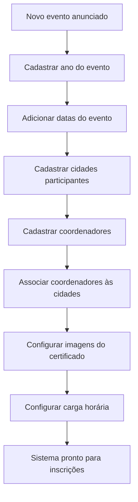

# Para Administradores

Bem-vindo à documentação para **administradores (superadmins)** do Sistema Pint of Science Brasil! Esta seção contém todos os guias e instruções necessárias para gerenciar completamente o sistema.

## 🎯 Seu Papel como Administrador

Como administrador, você tem **controle total** sobre o sistema e é responsável por:

- ✅ Gerenciar coordenadores e suas permissões
- ✅ Cadastrar e configurar eventos
- ✅ Gerenciar cidades e funções
- ✅ Configurar aspectos visuais dos certificados
- ✅ Auditar ações no sistema
- ✅ Manter a integridade dos dados

## 🚀 Começando

### 🔐 Gestão de Coordenadores

Criar, editar e gerenciar coordenadores de cidades.

- [Gestão de Coordenadores](gestao-coordenadores.md)

### 📅 Gestão de Eventos

Configurar eventos anuais do Pint of Science.

- [Gestão de Eventos](gestao-eventos.md)

### 🏙️ Gestão de Cidades

Cadastrar e gerenciar cidades participantes.

- [Gestão de Cidades](gestao-cidades.md)

### 🎭 Gestão de Funções

Definir funções dos participantes (palestrante, organizador, etc.).

- [Gestão de Funções](gestao-funcoes.md)

### 📊 Logs de Auditoria

Visualizar histórico completo de ações no sistema.

- [Logs de Auditoria](auditoria.md)

## 🔐 Acesso ao Sistema

### Como Acessar a Área Administrativa

1. Faça login na página inicial com suas credenciais de **superadmin**
2. Após login, acesse o menu lateral
3. Clique em **"⚙️ Administração"**
4. Você verá o dashboard com estatísticas do sistema

!!! warning "Importante"

    Apenas usuários com privilégios de **superadmin** podem acessar esta área. Coordenadores comuns não têm acesso.

## 📊 Dashboard Administrativo

Ao acessar a área de administração, você vê:

### Métricas Gerais

```
┌─────────────────────────┐  ┌─────────────────────────┐
│  👥 Total de            │  │  ✅ Participantes       │
│  Participantes: 1.234   │  │  Validados: 987         │
└─────────────────────────┘  └─────────────────────────┘

┌─────────────────────────┐  ┌─────────────────────────┐
│  🏙️ Cidades             │  │  👤 Coordenadores       │
│  Cadastradas: 45        │  │  Ativos: 23             │
└─────────────────────────┘  └─────────────────────────┘
```

### Abas Disponíveis

O painel administrativo está organizado em **6 abas principais**:

| Aba                  | Função                | Descrição                                         |
| -------------------- | --------------------- | ------------------------------------------------- |
| **👤 Coordenadores** | Gestão de usuários    | Criar, editar e associar coordenadores às cidades |
| **📅 Eventos**       | Gestão de eventos     | Cadastrar anos e datas dos eventos                |
| **🏙️ Cidades**       | Gestão de cidades     | Adicionar cidades participantes                   |
| **🎭 Funções**       | Gestão de funções     | Definir funções dos participantes                 |
| **🖼️ Certificado**   | Personalização visual | Upload de logos e configuração de cores           |
| **⏱️ Carga Horária** | Configuração de horas | Definir cálculo de carga horária por ano          |

## 🎯 Fluxo de Trabalho Típico

### Preparação para Novo Evento



### Ordem Recomendada de Configuração

1. **Evento** → Cadastre o ano e as datas do evento
2. **Cidades** → Adicione todas as cidades participantes
3. **Funções** → Defina as funções (se houver novas)
4. **Coordenadores** → Crie contas e associe cidades
5. **Certificado** → Configure visual (logos e cores)
6. **Carga Horária** → Defina regras de cálculo

## 🔒 Responsabilidades e Permissões

### O que você PODE fazer:

✅ **Gestão Completa de Dados**

- Criar, editar e deletar qualquer registro
- Acessar dados de todas as cidades
- Visualizar informações descriptografadas

✅ **Configuração do Sistema**

- Personalizar certificados por ano
- Definir regras de carga horária
- Configurar aspectos visuais

✅ **Auditoria e Monitoramento**

- Ver logs de todas as ações
- Identificar inconsistências
- Gerar relatórios completos

### O que você DEVE ter cuidado:

⚠️ **Deletar Registros**

- Certifique-se antes de deletar (ação irreversível)
- Alguns registros não podem ser deletados se em uso
- Sempre verifique dependências

⚠️ **Compartilhar Acesso**

- Credenciais de superadmin são sensíveis
- Não compartilhe com pessoas não autorizadas
- Crie coordenadores para acesso limitado

⚠️ **Modificar Dados Validados**

- Mudanças em eventos afetam certificados já emitidos
- Alterar cidades pode quebrar associações
- Sempre comunique mudanças importantes

## 🛠️ Funcionalidades Especiais

### Edição em Massa com Data Editor

Várias seções usam o **data_editor** do Streamlit para edição eficiente:

- ✅ Edite múltiplos registros de uma vez
- ✅ Adicione novas linhas clicando no **+**
- ✅ Delete registros deixando campos obrigatórios vazios
- ✅ Salve tudo de uma vez com botão "💾 Salvar"

### Deleção Inteligente

O sistema protege contra deleções acidentais:

- **Coordenadores**: Não pode deletar o último superadmin
- **Eventos**: Só deleta se não houver participantes associados
- **Cidades**: Só deleta se não houver participantes ou coordenadores
- **Funções**: Só deleta se não estiver em uso

### Validação Automática

Todos os formulários têm validação:

- ✅ E-mails validados formato correto
- ✅ Campos obrigatórios marcados com \*
- ✅ Datas no formato brasileiro (DD/MM/YYYY)
- ✅ Prevenção de duplicatas

## 📱 Interface Responsiva

O painel administrativo funciona em qualquer dispositivo:

- ✅ Desktop/Laptop: Experiência completa
- ✅ Tablet: Interface adaptada
- ✅ Smartphone: Funcional (recomendado para consultas)

!!! info "Recomendação"

    Para tarefas complexas de configuração, prefira usar um computador desktop/laptop.

## 🆘 Suporte e Problemas

### Problemas Comuns

| Problema                           | Solução                                     |
| ---------------------------------- | ------------------------------------------- |
| Não consigo deletar um coordenador | Verifique se não é o último superadmin      |
| Erro ao deletar evento             | Certifique-se de que não há participantes   |
| Imagem não aparece no certificado  | Verifique formato (PNG) e tamanho (máx 2MB) |
| Coordenador não vê cidade          | Verifique associação coordenador-cidade     |

### Logs de Erro

Se encontrar erros:

1. Verifique a mensagem de erro exibida
2. Consulte os logs de auditoria
3. Tente refazer a operação
4. Contate o suporte técnico se persistir

## 📚 Guias Detalhados

Explore os guias completos para cada funcionalidade:

### Gestão de Entidades

- [Gestão de Coordenadores](gestao-coordenadores.md) - Criar e gerenciar usuários
- [Gestão de Cidades](gestao-cidades.md) - Cadastrar cidades participantes
- [Gestão de Eventos](gestao-eventos.md) - Configurar eventos anuais
- [Gestão de Funções](gestao-funcoes.md) - Definir funções dos participantes

### Monitoramento

- [Logs de Auditoria](auditoria.md) - Rastrear ações no sistema

### Configuração Visual

- [Imagens do Certificado](../configuracao/imagens-certificado.md) - Upload de logos
- [Cores e Personalização](../configuracao/cores-fontes.md) - Customizar cores
- [Carga Horária](../configuracao/carga-horaria.md) - Configurar cálculo de horas

## 🎓 Boas Práticas

### Para Gerenciamento Eficiente:

1. **Planeje antes de executar** - Tenha clareza das mudanças necessárias
2. **Documente decisões** - Anote mudanças importantes
3. **Teste com dados de teste** - Valide configurações antes de produção
4. **Faça backup regular** - Mantenha cópias do banco de dados
5. **Comunique mudanças** - Informe coordenadores sobre alterações

### Para Segurança:

1. **Use senha forte** - Mínimo 8 caracteres, misture letras/números
2. **Troque senha regularmente** - A cada 3-6 meses
3. **Não compartilhe credenciais** - Crie contas individuais
4. **Faça logout em PCs compartilhados** - Sempre use o botão "Sair"
5. **Revise logs periodicamente** - Identifique acessos suspeitos

### Para Manutenção:

1. **Revise dados periodicamente** - Corrija inconsistências
2. **Archive eventos antigos** - Mantenha sistema organizado
3. **Atualize configurações** - Adapte para novas necessidades
4. **Monitore performance** - Identifique lentidão ou problemas
5. **Mantenha documentação** - Atualize procedimentos internos

---

## ✅ Checklist do Administrador

Antes de lançar um novo evento:

- [ ] Evento cadastrado com ano e datas corretas
- [ ] Todas as cidades participantes cadastradas
- [ ] Funções atualizadas (se houver novas)
- [ ] Coordenadores criados e associados às cidades
- [ ] Logos do certificado enviados (logo, assinatura, patrocinadores)
- [ ] Cores do certificado configuradas
- [ ] Carga horária configurada corretamente
- [ ] Teste de geração de certificado realizado
- [ ] Coordenadores notificados sobre acesso
- [ ] Documentação interna atualizada

---

!!! success "Tudo configurado?"

    Agora os coordenadores podem começar a validar participantes e o sistema está pronto para gerar certificados!
