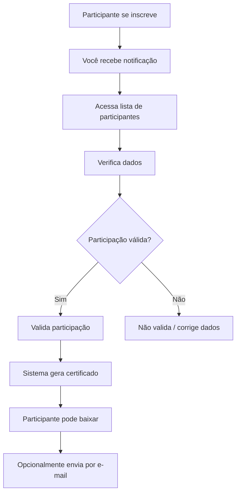

# Para Coordenadores

Bem-vindo à documentação para **coordenadores** do Sistema Pint of Science Brasil! Esta seção contém todos os guias e instruções necessárias para gerenciar participantes e validar certificados em sua(s) cidade(s).

## 🎯 Seu Papel como Coordenador

Como coordenador, você é responsável por:

- ✅ Validar a participação efetiva dos inscritos
- ✅ Gerenciar dados dos participantes da sua cidade
- ✅ Enviar certificados por e-mail (opcional)
- ✅ Gerar relatórios de participação
- ✅ Garantir a qualidade dos dados

## 🚀 Começando

### 🔐 Fazer Login

Aprenda como acessar o sistema e gerenciar sua sessão.

- [Guia de acesso](acesso-sistema.md)

### ✅ Validar Participantes

Passo a passo para validar inscrições de participantes.

- [Como validar](validar-participantes.md)

### 👥 Gerenciar Dados

Editar informações e corrigir dados dos participantes.

- [Gerenciar participantes](gerenciar-participantes.md)

### 📧 Enviar Certificados

Envie certificados por e-mail para os participantes.

- [Envio de certificados](enviar-certificados.md)

### 📊 Relatórios

Visualize estatísticas e gere relatórios de participação.

- [Ver relatórios](relatorios.md)

## 🔐 Acesso ao Sistema

### Credenciais

Você receberá do administrador do sistema:

- **E-mail** de acesso
- **Senha** inicial (recomendamos alterar após primeiro login)
- **Cidades** que você pode gerenciar

### Primeiro Acesso

1. Acesse a página inicial do sistema
2. Clique na aba "🔐 Login Coordenador"
3. Digite seu e-mail e senha
4. Clique em "Login"

**Importante:** Sua sessão permanece ativa por 30 dias. Use o botão "Sair" em computadores compartilhados.

[:octicons-arrow-right-24: Guia completo de acesso](acesso-sistema.md)

## 👥 Gerenciamento de Participantes

### Sua Área de Trabalho

Após login, acesse:

```
Menu Lateral → 👨‍👨‍👦‍👦 Participantes
```

Nesta página você pode:

| Ação             | Descrição                           |
| ---------------- | ----------------------------------- |
| **Visualizar**   | Ver lista de todos os participantes |
| **Filtrar**      | Buscar por cidade, função, status   |
| **Validar**      | Aprovar participações em lote       |
| **Editar**       | Corrigir dados de participantes     |
| **Estatísticas** | Ver métricas e números              |

### Fluxo de Trabalho Típico



## 📊 Dashboard e Estatísticas

Ao acessar a página de Participantes, você vê:

### Métricas Principais

- 👥 **Total de Inscrições**: Quantas pessoas se inscreveram
- ✅ **Validados**: Quantos já foram aprovados
- ⏳ **Pendentes**: Quantos aguardam validação
- 📍 **Por Cidade**: Distribuição geográfica

### Gráficos

- Participações por dia
- Distribuição por função
- Taxa de validação
- Evolução temporal

## 🎯 Responsabilidades

### O que você DEVE fazer:

✅ **Validar apenas participações reais**

- Confirme que a pessoa realmente esteve presente
- Verifique se as datas estão corretas
- Confirme se a função está adequada

✅ **Manter dados atualizados**

- Corrija erros de digitação
- Atualize informações quando necessário
- Mantenha consistência nos dados

✅ **Responder participantes**

- Responda dúvidas quando contatado
- Ajude com problemas de acesso
- Explique procedimentos quando necessário

### O que você NÃO DEVE fazer:

❌ **Validar participações falsas**

- Nunca valide quem não participou
- Não crie participações fictícias

❌ **Compartilhar credenciais**

- Não compartilhe sua senha
- Não deixe outras pessoas usarem seu login

❌ **Alterar dados sem motivo**

- Só edite quando necessário e justificado
- Toda edição fica registrada em log

## 🔍 Recursos Disponíveis

### Filtros Avançados

Busque participantes por:

- 📍 **Cidade**: Filtre por cidade específica
- 👤 **Função**: Veja apenas palestrantes, voluntários, etc.
- ✅ **Status**: Apenas validados ou pendentes
- 📅 **Data**: Participantes de datas específicas
- 🔤 **Nome/E-mail**: Busca textual

### Ações em Lote

Economize tempo validando múltiplos participantes:

1. Selecione participantes (checkboxes)
2. Clique em "Validar Selecionados"
3. Confirme a ação
4. Todos são validados simultaneamente

### Edição Interativa

Use o editor de dados inline:

- Clique diretamente nas células
- Edite os valores
- Mudanças são salvas automaticamente
- Logs de auditoria registram alterações

## 📧 Comunicação com Participantes

### E-mails Automáticos

O sistema pode enviar e-mails automáticos (se configurado):

- Confirmação de inscrição
- Notificação de validação
- Envio do certificado em anexo

### Contato Direto

Para contato individual:

- Use os e-mails exibidos na lista (descriptografados para você)
- Responda dúvidas sobre validação
- Oriente sobre o download de certificados

!!! tip "Dica"

    Mantenha um tom profissional e cordial ao interagir com participantes!

## 🔒 Segurança e Privacidade

### Dados Criptografados

Você tem acesso a dados descriptografados dos participantes, mas:

- ✅ Dados são criptografados no banco
- ✅ Apenas coordenadores autorizados veem
- ✅ Acessos são registrados em log
- ✅ Siga as diretrizes da LGPD

### Auditoria

Todas suas ações são registradas:

- Login/logout
- Validações realizadas
- Edições de dados
- Envios de e-mail

!!! warning "Importante"

    Use o sistema de forma responsável. Todas as ações podem ser auditadas.

## 📱 Acesso Mobile

O sistema funciona em tablets e smartphones:

- ✅ Interface responsiva
- ✅ Todas as funcionalidades disponíveis
- ✅ Validação em qualquer lugar
- ✅ Relatórios acessíveis

!!! info "Recomendação"

    Para edições complexas, prefira usar um computador desktop/laptop.

## 🆘 Suporte

### Problemas Comuns

| Problema              | Solução                                     |
| --------------------- | ------------------------------------------- |
| Esqueci minha senha   | Entre em contato com administrador          |
| Não vejo minha cidade | Verifique com administrador suas permissões |
| Erro ao validar       | Recarregue página e tente novamente         |
| Sessão expirou        | Faça login novamente                        |

### Contato

Se precisar de ajuda:

1. Consulte esta documentação
2. Entre em contato com o administrador do sistema
3. Reporte bugs ou problemas técnicos

## 📚 Guias Detalhados

Explore os guias completos para cada funcionalidade:

### Essenciais

- [Acesso ao Sistema](acesso-sistema.md) - Como fazer login e gerenciar sessão
- [Validar Participantes](validar-participantes.md) - Processo completo de validação
- [Gerenciar Participantes](gerenciar-participantes.md) - Edição e manutenção de dados

### Avançados

- [Enviar Certificados](enviar-certificados.md) - Envio em lote por e-mail
- [Relatórios e Estatísticas](relatorios.md) - Análise de dados e métricas

## 🎓 Boas Práticas

### Para Validação Eficiente:

1. **Reserve tempo específico** para validar participantes (não faça com pressa)
2. **Valide em lotes** quando possível (mais eficiente)
3. **Verifique lista de presença física** antes de validar
4. **Corrija erros imediatamente** ao identificar
5. **Comunique participantes** sobre o status

### Para Manutenção de Dados:

1. **Padronize nomes**: "Maria Silva" não "MARIA SILVA"
2. **Verifique e-mails**: Certifique-se de que estão corretos
3. **Confirme datas**: Apenas dias reais de participação
4. **Documente mudanças**: Anote motivo de alterações significativas

### Para Comunicação:

1. **Seja claro e objetivo** nas mensagens
2. **Responda em até 48h** quando possível
3. **Use tom profissional** mas amigável
4. **Oriente sobre procedimentos** quando necessário

---

## ✅ Checklist do Coordenador

Após um evento, siga este checklist:

- [ ] Fazer login no sistema
- [ ] Acessar página de Participantes
- [ ] Filtrar participantes da sua cidade
- [ ] Verificar lista de presença física
- [ ] Validar participantes confirmados
- [ ] Corrigir erros de dados se necessário
- [ ] Enviar certificados por e-mail (opcional)
- [ ] Verificar estatísticas finais
- [ ] Responder dúvidas de participantes

---

!!! success "Pronto para começar?"

    Acesse o [Guia de Acesso ao Sistema](acesso-sistema.md) e comece a gerenciar seus participantes!
