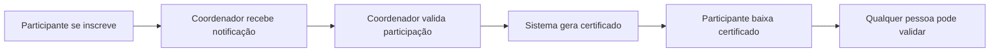

# Guia Rápido de Uso

Este guia rápido vai te ajudar a começar a usar o Sistema Pint of Science Brasil em poucos minutos!

## 🎯 Escolha seu Caminho

=== "Sou Participante"

    ### Como obter meu certificado em 3 passos:

    **Passo 1: Inscreva-se**

    1. Acesse a página inicial do sistema
    2. Vá até a aba **"📝 Inscrição"**
    3. Preencha o formulário com seus dados
    4. Clique em **"Enviar Inscrição"**

    **Passo 2: Aguarde a Validação**

    - O coordenador da sua cidade irá validar sua participação
    - Você receberá um e-mail quando seu certificado estiver disponível

    **Passo 3: Baixe seu Certificado**

    1. Vá até a aba **"📥 Baixar Certificado"**
    2. Digite seu e-mail (o mesmo usado na inscrição)
    3. Clique em **"👁️ Visualizar Certificado"**
    4. Baixe o PDF do seu certificado!

    ---

    [:octicons-arrow-right-24: Detalhes completos sobre inscrição](participantes/como-se-inscrever.md)

=== "Sou Coordenador"

    ### Como validar participantes em 3 passos:

    **Passo 1: Faça Login**

    1. Acesse a página inicial
    2. Vá até a aba **"🔐 Login Coordenador"**
    3. Digite seu e-mail e senha
    4. Clique em **"Login"**

    **Passo 2: Acesse a Lista de Participantes**

    1. No menu lateral, clique em **"👨‍👨‍👦‍👦 Participantes"**
    2. Você verá a lista de participantes da(s) sua(s) cidade(s)

    **Passo 3: Valide os Participantes**

    1. Use os filtros para encontrar participantes específicos
    2. Marque as caixas de seleção dos participantes a validar
    3. Clique em **"✅ Validar Selecionados"**
    4. Confirme a ação

    ---

    [:octicons-arrow-right-24: Guia completo de validação](coordenadores/validar-participantes.md)

=== "Sou Administrador"

    ### Como administrar o sistema:

    **Acesso ao Painel**

    1. Faça login como coordenador
    2. No menu lateral, clique em **"⚙️ Administração"**
    3. Você verá várias abas de gestão

    **Principais Funcionalidades**

    - **Coordenadores**: Gerenciar usuários do sistema
    - **Eventos**: Cadastrar edições do Pint of Science
    - **Cidades**: Gerenciar cidades participantes
    - **Funções**: Definir funções dos participantes
    - **Cores**: Personalizar visual dos certificados
    - **Imagens**: Upload de logos e assinaturas
    - **Carga Horária**: Configurar cálculo de horas
    - **Auditoria**: Ver logs de ações no sistema

    ---

    [:octicons-arrow-right-24: Documentação completa de administração](administradores/index.md)

## 🔑 Recursos Principais

### 1. Inscrição de Participantes

**Onde**: Página inicial → Aba "📝 Inscrição"

**O que faz**: Permite que participantes se registrem no sistema informando:

- Nome completo
- E-mail
- Cidade onde participou
- Função que exerceu
- Datas de participação

### 2. Download de Certificados

**Onde**: Página inicial → Aba "📥 Baixar Certificado"

**O que faz**: Participantes validados podem baixar seus certificados em PDF digitando apenas o e-mail.

### 3. Validação de Certificados

**Onde**: Menu lateral → "✅ Validar Certificado"

**O que faz**: Qualquer pessoa pode verificar a autenticidade de um certificado:

- Clicando no link no rodapé do PDF, ou
- Inserindo manualmente o código de validação

### 4. Gestão de Participantes

**Onde**: Menu lateral → "👨‍👨‍👦‍👦 Participantes" (requer login)

**O que faz**: Coordenadores podem:

- Ver lista de participantes
- Filtrar por cidade, função, status
- Validar participações
- Editar dados
- Ver estatísticas

### 5. Administração do Sistema

**Onde**: Menu lateral → "⚙️ Administração" (requer superadmin)

**O que faz**: Administradores têm controle total sobre:

- Usuários e permissões
- Cadastros (eventos, cidades, funções)
- Configuração visual dos certificados
- Carga horária
- Logs de auditoria

## 💡 Dicas Importantes

!!! tip "E-mail deve ser exato"

    Ao baixar certificado, use **exatamente** o mesmo e-mail usado na inscrição (incluindo maiúsculas/minúsculas).

!!! warning "Validação necessária"

    Participantes só podem baixar certificados **após validação** pelo coordenador.

!!! info "Sessão persistente"

    Coordenadores permanecem logados por 30 dias. Use o botão "Sair" ao usar computador compartilhado.

!!! success "Certificado seguro"

    Cada certificado tem um código único de validação. Empregadores podem verificar autenticidade online.

## 📊 Fluxo Completo do Sistema

## 🆘 Problemas Comuns

### "Não encontrei meu certificado"

**Possíveis causas:**

1. Participação ainda não foi validada pelo coordenador
2. E-mail digitado diferente do usado na inscrição
3. Inscrição não foi realizada

**Solução**: Verifique o e-mail e aguarde validação. Se persistir, entre em contato com o coordenador.

### "Esqueci minha senha de coordenador"

**Solução**: Entre em contato com o administrador do sistema para redefinir sua senha.

### "Certificado não abre ou está corrompido"

**Solução**: Tente baixar novamente. Verifique se tem um leitor de PDF instalado (Adobe Reader, Foxit, navegador web).

---

## 📚 Próximos Passos

Agora que você conhece o básico, explore os guias detalhados:

- [Como se Inscrever - Guia Completo](participantes/como-se-inscrever.md)
- [Validação de Participantes - Passo a Passo](coordenadores/validar-participantes.md)
- [Configuração do Sistema](configuracao/index.md)
- [Perguntas Frequentes](participantes/faq.md)

!!! question "Ainda com dúvidas?"

    Consulte a página de [Suporte](suporte.md) para entrar em contato!
