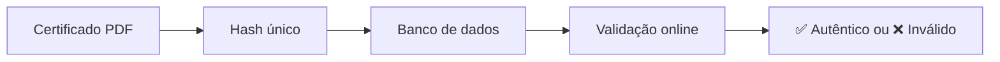

# Validar Certificado

O Sistema Pint of Science Brasil possui um recurso de **validação de autenticidade** que permite a qualquer pessoa ou instituição verificar se um certificado é genuíno e foi emitido oficialmente pelo sistema.

## 🔍 O que é Validação de Certificado?

A validação de certificado é um processo que verifica:

- ✅ Se o certificado foi realmente emitido pelo sistema
- ✅ Se os dados no certificado não foram adulterados
- ✅ Se o certificado ainda é válido
- ✅ Informações detalhadas do participante

## 🎯 Quem pode validar?

**Qualquer pessoa!** A validação é pública e não requer login. É útil para:

- 👥 **Empregadores** verificando certificados de candidatos
- 🏫 **Instituições de ensino** validando horas complementares
- 🎓 **Universidades** verificando participação em extensão
- 📄 **RH** conferindo documentos apresentados
- 🔍 **Qualquer interessado** na autenticidade

## 🔐 Como Funciona a Segurança?

Cada certificado possui:

- **Hash único** gerado com HMAC-SHA256
- **Assinatura digital** impossível de falsificar
- **Registro no banco de dados** com timestamp
- **Link de validação** direto no PDF



## 📱 Métodos de Validação

Existem **duas formas** de validar um certificado:

### Método 1: Link Direto (Recomendado)

#### Passo a Passo:

1. **Abra o certificado PDF**
2. **Localize o rodapé** da página
3. **Clique no link** que aparece como:

```
🔗 Valide este certificado em: https://[sistema]/Validar...
```

4. **Você será redirecionado** automaticamente para a página de validação
5. **O resultado aparece imediatamente**

!!! success "Método mais rápido"

    Este é o método mais rápido e conveniente!

### Método 2: Código Manual

#### Passo a Passo:

1. **Acesse o sistema**
2. **No menu lateral**, clique em:

```
✅ Validar Certificado
```

3. **Localize o código** no rodapé do PDF:

```
Código de validação: abc123def456...
```

4. **Copie o código completo**
5. **Cole** no campo "Código de Validação"
6. **Clique** em "Validar Certificado"

!!! info "Quando usar?"

    Use este método quando: - O link direto não funcionar - Você tem apenas o código impresso - Está validando offline/posteriormente

## 🖥️ Interface de Validação

### Acessando a Página

**Menu lateral → ✅ Validar Certificado**


### Formulário de Validação

Você verá um formulário simples:

```
┌─────────────────────────────────────┐
│ Código de Validação:                │
│ ┌─────────────────────────────────┐ │
│ │ Cole o código aqui...           │ │
│ └─────────────────────────────────┘ │
│                                     │
│    [🔍 Validar Certificado]        │
└─────────────────────────────────────┘
```

## ✅ Resultados da Validação

### Certificado Válido

Se o certificado for **autêntico**, você verá:

#### Mensagem de Sucesso (Verde)

```
✅ Certificado Válido!
Este certificado foi emitido oficialmente pelo
Sistema Pint of Science Brasil.
```

#### Informações Exibidas

| Campo                     | Exemplo                                  |
| ------------------------- | ---------------------------------------- |
| **Nome**                  | Maria da Silva Santos                    |
| **Evento**                | Pint of Science 2025                     |
| **Cidade**                | São Paulo - SP                           |
| **Função**                | Palestrante                              |
| **Carga Horária**         | 12 horas                                 |
| **Datas de Participação** | 20/05/2025, 21/05/2025, 22/05/2025       |
| **Data de Validação**     | 25/05/2025 às 14:30                      |
| **Validado por**          | João Coordenador (coordenador@email.com) |

!!! success "Certificado Autêntico"

    Todas essas informações garantem que o certificado é legítimo!

### Certificado Inválido

Se o certificado **não for autêntico**, você verá:

#### Mensagem de Erro (Vermelho)

```
❌ Certificado Inválido!
Este código não corresponde a nenhum certificado
em nosso sistema.
```

#### Possíveis Causas:

| Causa                      | Explicação                             |
| -------------------------- | -------------------------------------- |
| **Código digitado errado** | Erro de digitação ou cópia incompleta  |
| **Certificado falso**      | Documento não foi emitido pelo sistema |
| **Certificado revogado**   | Foi invalidado posteriormente          |
| **Hash corrompido**        | PDF foi modificado após emissão        |

!!! danger "Atenção!"

    Um certificado inválido pode indicar falsificação!

## 🔍 Verificando Detalhes

### Informações Detalhadas

Ao validar, o sistema mostra:

#### 1. Dados do Participante

- Nome completo
- Evento e ano
- Cidade de participação
- Função exercida

#### 2. Dados da Participação

- Datas específicas de participação
- Carga horária total
- Cálculo da carga horária

#### 3. Dados da Validação

- Quem validou (coordenador)
- Quando foi validado (data e hora)
- E-mail do coordenador

#### 4. Dados Técnicos

- Hash de validação
- Timestamp de criação
- Status do certificado

## 📄 Casos de Uso

### Para Empregadores

**Situação:** Candidato apresentou certificado do Pint of Science

**Como validar:**

1. Solicite o PDF do certificado
2. Clique no link de validação no rodapé
3. Verifique se nome e dados batem
4. Confirme a carga horária
5. Anote o resultado

### Para Instituições de Ensino

**Situação:** Aluno quer usar para horas complementares

**Como validar:**

1. Peça o código de validação do certificado
2. Acesse a página de validação do sistema
3. Insira o código
4. Verifique a carga horária
5. Confirme se a função se enquadra nas regras da instituição

!!! info "Horas Complementares"

    Verifique se a função do aluno (ex: Voluntário, Participante) é aceita pela sua instituição.

### Para o Próprio Participante

**Situação:** Você quer ter certeza de que seu certificado é válido

**Como validar:**

1. Baixe seu certificado
2. Clique no link de validação
3. Confirme que todos os dados estão corretos
4. Guarde o print da validação

## 🛡️ Segurança Técnica

### Como o Sistema Previne Falsificações?

#### 1. Hash Criptográfico

```python
hash = HMAC-SHA256(dados_do_certificado + chave_secreta)
```

- Impossível gerar sem a chave secreta
- Qualquer alteração invalida o hash
- Algoritmo padrão da indústria

#### 2. Armazenamento Seguro

- Hash armazenado no banco de dados
- Comparação em tempo real
- Timestamp de criação registrado

#### 3. Validação em Tempo Real

- Cada validação consulta o banco atual
- Certificados revogados ficam inválidos imediatamente
- Não há cache de resultados

## 🚫 O que NÃO É Possível

### Limitações do Sistema

❌ **Não é possível baixar o certificado pela validação**

- A validação apenas confirma autenticidade
- Para baixar, use a aba "Baixar Certificado"

❌ **Não é possível ver certificados de outras pessoas**

- Apenas validar se um código específico é válido
- Privacidade dos dados é mantida

❌ **Não é possível listar todos os certificados**

- Só valida códigos específicos fornecidos
- Não há busca pública por nome

## 🔄 Certificados Revogados

### O que acontece se um certificado for revogado?

Se um coordenador **invalidar** a participação de alguém:

1. ✅ O certificado **imediatamente** fica inválido
2. ✅ Tentativas de validação mostrarão "Inválido"
3. ✅ O download não ficará mais disponível
4. ✅ Links antigos param de funcionar

### Por que um certificado seria revogado?

- Erro nos dados que precisou ser corrigido
- Participação indevida identificada posteriormente
- Duplicação de registro
- Solicitação do próprio participante

## 📱 Validação pelo Celular

A validação funciona perfeitamente em dispositivos móveis!

### Pelo Link Direto:

1. Abra o PDF no celular
2. Toque no link de validação
3. Abre automaticamente no navegador
4. Resultado aparece na tela

### Pelo Código Manual:

1. Abra o navegador
2. Acesse o sistema
3. Vá em "Validar Certificado"
4. Cole o código
5. Toque em "Validar"

## ❓ Perguntas Frequentes

### O código de validação muda?

Não. Uma vez gerado, o código é **permanente** para aquele certificado.

### Quantas vezes posso validar?

**Ilimitadas!** Você pode validar quantas vezes quiser.

### A validação funciona offline?

Não. É necessária conexão com internet para consultar o banco de dados.

### Posso validar certificados antigos?

Sim! Certificados de qualquer ano podem ser validados, desde que não tenham sido revogados.

### O que fazer se o código não funciona?

1. Verifique se copiou o código completo
2. Tente copiar novamente (sem espaços extras)
3. Use o link direto do PDF
4. Entre em contato com o suporte

### Empregadores confiam nessa validação?

Sim! A validação online é amplamente aceita e mais confiável que certificados apenas em papel.

---

## 📚 Recursos Relacionados

- [Como baixar certificados](baixar-certificado.md)
- [Como se inscrever](como-se-inscrever.md)
- [Perguntas frequentes](faq.md)
- [Suporte técnico](../suporte.md)

!!! info "Sistema Transparente"
A validação pública garante transparência e confiabilidade dos certificados emitidos!
