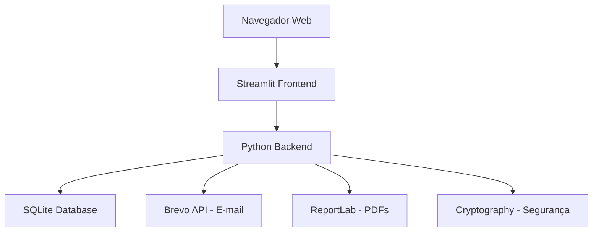
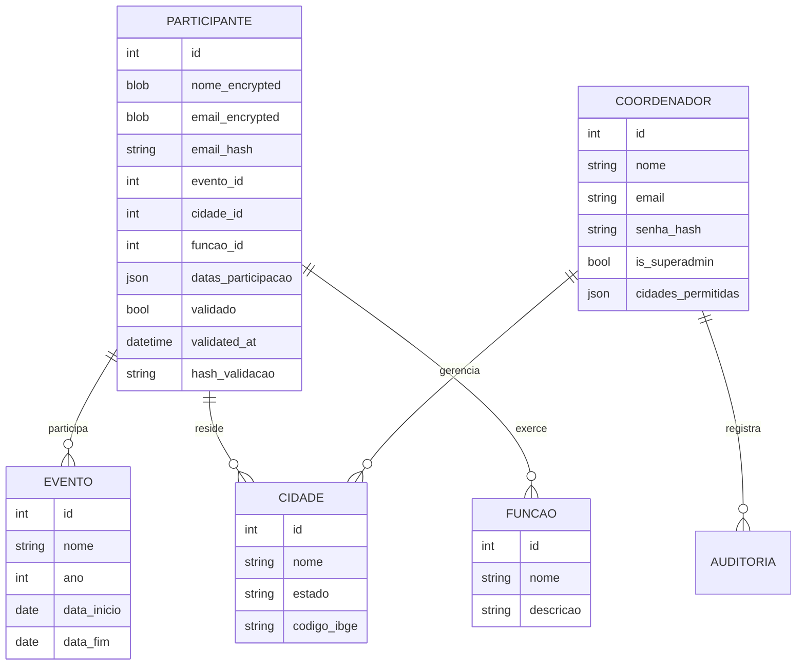
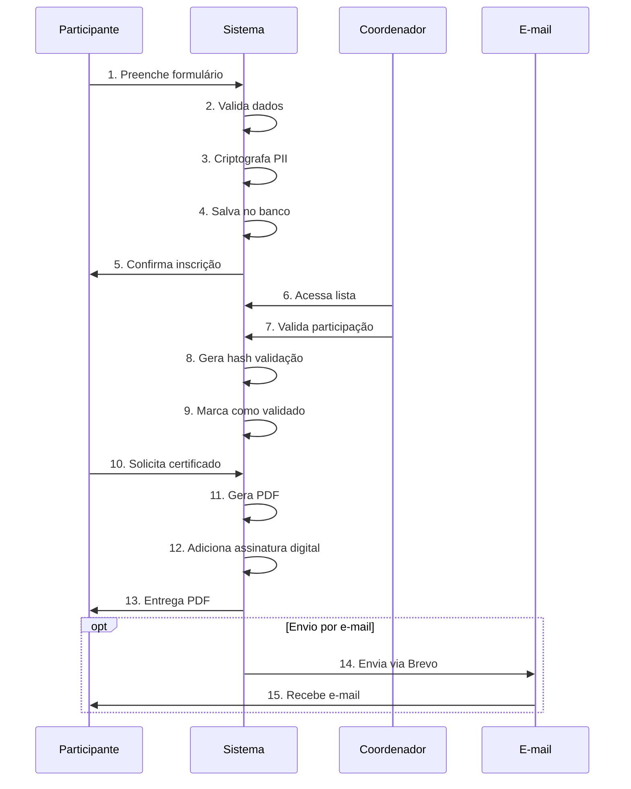

# Sobre o Sistema

## 📖 História e Propósito

O **Sistema de Certificados Pint of Science Brasil** foi desenvolvido para atender às necessidades específicas do evento Pint of Science, um festival internacional que leva cientistas aos bares para compartilhar descobertas científicas com o público geral de forma acessível e descontraída.

### Por que este sistema?

Antes deste sistema, o processo de emissão de certificados era:

- ❌ Manual e demorado
- ❌ Propenso a erros
- ❌ Difícil de gerenciar em múltiplas cidades
- ❌ Sem validação de autenticidade
- ❌ Baixa rastreabilidade

Com o sistema, conseguimos:

- ✅ Automatizar 100% da emissão de certificados
- ✅ Validação online de autenticidade
- ✅ Gestão centralizada de múltiplas cidades
- ✅ Auditoria completa de ações
- ✅ Segurança e privacidade de dados

## 🏗️ Arquitetura do Sistema

### Visão Geral Técnica

O sistema foi desenvolvido com tecnologias modernas e confiáveis:



### Tecnologias Utilizadas

| Tecnologia       | Propósito                 | Versão |
| ---------------- | ------------------------- | ------ |
| **Python**       | Linguagem principal       | 3.11+  |
| **Streamlit**    | Framework web/interface   | Latest |
| **SQLite**       | Banco de dados            | 3.x    |
| **SQLAlchemy**   | ORM (mapeamento de dados) | 2.x    |
| **Pydantic**     | Validação de dados        | 2.x    |
| **Cryptography** | Criptografia de PII       | Latest |
| **ReportLab**    | Geração de PDFs           | Latest |
| **Brevo**        | Serviço de e-mail         | API v3 |
| **bcrypt**       | Hash de senhas            | Latest |

### Módulos do Sistema

O sistema está organizado em módulos bem definidos:

```
app/
├── core.py        # Configurações e ambiente
├── models.py      # Modelos de dados
├── db.py          # Gerenciamento do banco
├── auth.py        # Autenticação e sessão
├── services.py    # Lógica de negócio
└── utils.py       # Funções utilitárias
```

## 🔒 Segurança e Privacidade

### Criptografia de Dados Pessoais

**O que é criptografado:**

- Nome completo dos participantes
- Endereço de e-mail

**Como funciona:**

- Algoritmo: **Fernet** (criptografia simétrica)
- Dados armazenados como BLOB no banco
- Chave de criptografia em variável de ambiente
- Impossível acessar dados sem a chave

### Autenticação de Coordenadores

**Recursos de segurança:**

- Senhas com hash **bcrypt** (irreversível)
- Sessões persistentes com cookies seguros
- Timeout automático de inatividade
- Proteção contra força bruta

### Validação de Certificados

**Sistema de assinatura digital:**

- Algoritmo: **HMAC-SHA256**
- Hash único por certificado
- Impossível falsificar sem chave secreta
- Validação online em tempo real

### Logs de Auditoria

**O que é registrado:**

- Todas as ações de coordenadores
- Todas as ações de administradores
- Timestamp preciso de cada ação
- IP e usuário responsável

## 🌐 Arquitetura Multi-Página

O sistema utiliza uma arquitetura multi-página do Streamlit:

### Página Principal (Pública)

**Arquivo**: `🏠_Home.py`

**Funcionalidades**:

- Inscrição de participantes
- Download de certificados
- Login de coordenadores

### Páginas Protegidas

#### 1. Participantes (Coordenadores)

**Arquivo**: `pages/1_👨‍👨‍👦‍👦_Participantes.py`

**Funcionalidades**:

- Visualização de participantes
- Validação de participações
- Edição de dados
- Estatísticas

#### 2. Administração (Superadmin)

**Arquivo**: `pages/2_⚙️_Administração.py`

**Funcionalidades**:

- CRUD completo
- Configurações do sistema
- Gestão de usuários
- Logs de auditoria

#### 3. Validação de Certificados (Público)

**Arquivo**: `pages/3_✅_Validar_Certificado.py`

**Funcionalidades**:

- Validação por hash
- Validação por link direto
- Interface pública

## 📊 Modelo de Dados

### Entidades Principais



### Dados Criptografados

Os seguintes dados são **sempre criptografados** no banco:

| Campo             | Tabela        | Tipo    | Algoritmo |
| ----------------- | ------------- | ------- | --------- |
| `nome_encrypted`  | participantes | BLOB    | Fernet    |
| `email_encrypted` | participantes | BLOB    | Fernet    |
| `email_hash`      | participantes | VARCHAR | SHA-256   |

!!! info "Por que email_hash?"

    O campo `email_hash` permite fazer buscas eficientes por e-mail sem descriptografar todos os registros.

## 🎨 Personalização Visual

O sistema permite personalização completa dos certificados:

### Por Ano de Evento

Cada edição do evento pode ter:

- Logo próprio
- Assinatura dos organizadores
- Logos de patrocinadores
- Paleta de cores personalizada
- Configuração de carga horária

### Configurações Disponíveis

```json
{
  "2025": {
    "cores": {
      "titulo": "#c67b5c",
      "subtitulo": "#8b4513",
      "texto": "#333333",
      "destaque": "#d4af37"
    },
    "imagens": {
      "logo": "static/2025/logo.png",
      "assinatura": "static/2025/signature.png",
      "patrocinadores": "static/2025/sponsors.png"
    },
    "carga_horaria": {
      "horas_por_dia": 4,
      "horas_por_evento": 40,
      "funcoes_evento_completo": [1, 2, 3]
    }
  }
}
```

## 📈 Escalabilidade

### Capacidade Atual

O sistema foi projetado para suportar:

- ✅ Milhares de participantes por evento
- ✅ Centenas de cidades simultâneas
- ✅ Dezenas de coordenadores ativos
- ✅ Geração de PDFs sob demanda

### Limitações Conhecidas

- SQLite é adequado para até ~100.000 registros
- Para volumes maiores, migrar para PostgreSQL
- Upload de imagens limitado a 5MB por arquivo

## 🔄 Fluxo de Dados

### Inscrição → Certificado



## 🌟 Diferenciais

O que torna este sistema único:

1. **Validação de Autenticidade**: Link QR direto no certificado
2. **Privacidade por Design**: Dados sensíveis sempre criptografados
3. **Configuração Flexível**: Personalização por ano/edição
4. **Auditoria Completa**: Rastreabilidade total de ações
5. **Interface Intuitiva**: Fácil uso por usuários não-técnicos
6. **Deploy Simples**: Roda em qualquer servidor Python
7. **Código Aberto**: Transparente e auditável

## 📝 Conformidade e Boas Práticas

### LGPD (Lei Geral de Proteção de Dados)

O sistema foi desenvolvido considerando a LGPD:

- ✅ Minimização de dados (coleta apenas necessário)
- ✅ Criptografia de dados pessoais
- ✅ Logs de acesso e auditoria
- ✅ Consentimento implícito na inscrição
- ✅ Possibilidade de exclusão de dados

### Boas Práticas de Desenvolvimento

- ✅ Separação de responsabilidades (SoC)
- ✅ Princípio DRY (Don't Repeat Yourself)
- ✅ Injeção de dependências
- ✅ Testes automatizados
- ✅ Documentação inline e externa
- ✅ Versionamento de código (Git)
- ✅ Configuração por ambiente

## 🚀 Evolução Futura

### Recursos Planejados

- [ ] Envio em lote de certificados por e-mail
- [ ] Dashboard analítico avançado
- [ ] Exportação de relatórios em Excel
- [ ] API REST para integrações
- [ ] App mobile para coordenadores
- [ ] QR Code nos certificados
- [ ] Multi-idioma (EN, ES, PT)

### Melhorias Técnicas

- [ ] Migração para PostgreSQL (opcional)
- [ ] Cache Redis para performance
- [ ] Containerização Docker
- [ ] CI/CD automatizado
- [ ] Monitoramento com Sentry
- [ ] Backup automatizado

---

!!! question "Dúvidas sobre o sistema?"

    Consulte as outras seções da documentação ou entre em [contato conosco](suporte.md)!
