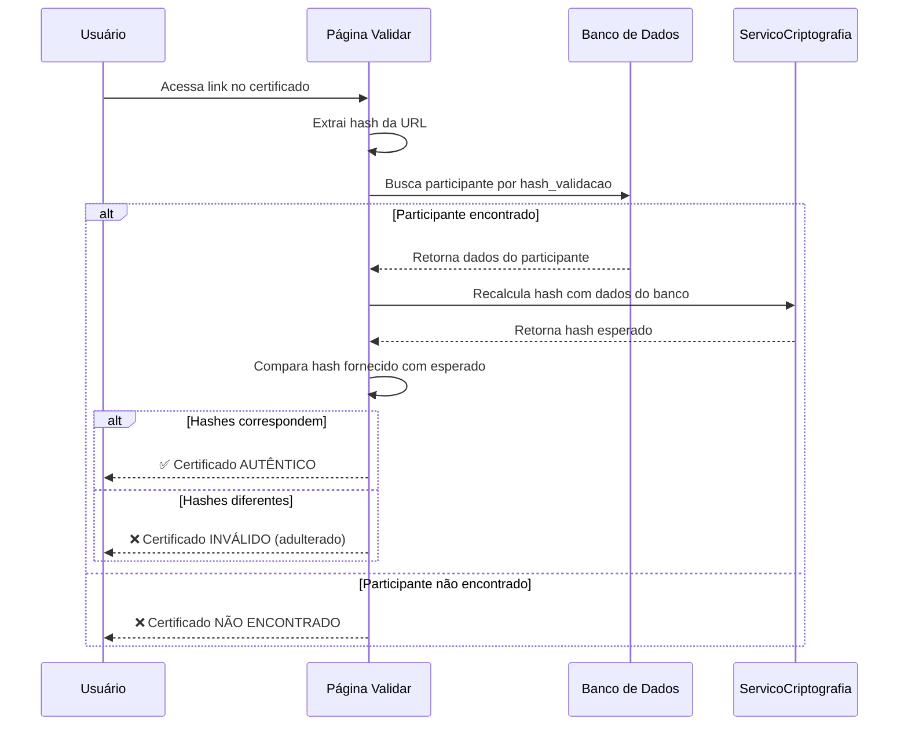

# Sistema de Validação de Certificados

## Visão Geral

O sistema de validação de certificados do Pint of Science Brasil garante a autenticidade de todos os certificados emitidos **sem necessidade de armazenar PDFs em disco**. Utiliza criptografia HMAC-SHA256 para gerar assinaturas digitais únicas e verificáveis.

## Como Funciona

### 1. Geração do Hash de Validação

Quando um certificado PDF é gerado, o sistema:

1. **Coleta dados do participante**: ID, evento, email, nome completo
2. **Gera assinatura HMAC**: Usa HMAC-SHA256 com chave secreta
3. **Salva no banco**: Armazena o hash na coluna `hash_validacao`
4. **Inclui no PDF**: Adiciona link clicável no rodapé do certificado

**Algoritmo:**

```
hash = HMAC-SHA256(
    key=CERTIFICATE_SECRET_KEY,
    message=f"{participante_id}|{evento_id}|{email}|{nome}"
)
```

### 2. Validação do Certificado

Qualquer pessoa pode validar um certificado:

1. **Acessa**: `https://seu-dominio.com/Validar_Certificado`
2. **Insere o hash**: 64 caracteres do rodapé do certificado
3. **Sistema verifica**: Busca no banco e recalcula o HMAC
4. **Confirma autenticidade**: Compara hashes usando `hmac.compare_digest()`

### 3. Segurança

#### Características de Segurança

- ✅ **Não requer armazenamento de PDFs**: Valida contra dados do banco
- ✅ **Prova a tampering**: Qualquer alteração invalida o hash
- ✅ **Único por certificado**: Mesmo participante em eventos diferentes gera hashes diferentes
- ✅ **Não forjável**: Requer chave secreta para gerar hash válido
- ✅ **Resistant a timing attacks**: Usa `hmac.compare_digest()` para comparação

#### Cenários de Falsificação

| Tentativa de Fraude              | Resultado                                  |
| -------------------------------- | ------------------------------------------ |
| Alterar nome no PDF              | ❌ Hash não corresponde aos dados do banco |
| Copiar hash de outro certificado | ❌ Hash vinculado a dados específicos      |
| Gerar hash falso                 | ❌ Impossível sem a chave secreta          |
| Modificar dados após emissão     | ❌ Recalculo do hash detecta alteração     |

## Configuração

### 1. Gerar Chave Secreta

```bash
# Opção 1: Script auxiliar
python utils/generate_certificate_key.py

# Opção 2: Python direto
python -c "import secrets; print(secrets.token_hex(32))"
```

### 2. Adicionar ao .env

```bash
# Certificate Secret Key para validação HMAC
CERTIFICATE_SECRET_KEY=sua_chave_de_64_caracteres_hexadecimais_aqui
```

### 3. Configurar BASE_URL

```bash
# URL base da aplicação (usado nos links de validação)
BASE_URL=https://pint.sistema.pro.br
```

## Estrutura do Banco de Dados

### Campo Adicionado: `hash_validacao`

```python
# Tabela: participantes
hash_validacao = Column(
    String(64),
    nullable=True,
    unique=True,
    index=True
)
```

- **Tipo**: String(64) - Hash HMAC-SHA256 em hexadecimal
- **Nullable**: True - Gerado na primeira emissão do certificado
- **Unique**: True - Cada hash é único
- **Indexed**: True - Busca rápida na validação

## API de Serviços

### `ServicoCriptografia.gerar_hash_validacao_certificado()`

Gera hash HMAC-SHA256 para validação.

```python
hash_validacao = servico_criptografia.gerar_hash_validacao_certificado(
    participante_id=123,
    evento_id=2024,
    email="participante@email.com",
    nome="Nome Completo"
)
# Retorna: '3f7a4b9c2d1e5a8f0c9b4e3d2a1f8e7c6d5b4a3c2d1e0f9a8b7c6d5e4f3a2b1c0'
```

### `ServicoCriptografia.verificar_hash_validacao_certificado()`

Verifica se um hash é autêntico.

```python
is_valid = servico_criptografia.verificar_hash_validacao_certificado(
    hash_fornecido="3f7a4b...",
    participante_id=123,
    evento_id=2024,
    email="participante@email.com",
    nome="Nome Completo"
)
# Retorna: True ou False
```

## Fluxo de Validação



## Uso no Certificado PDF

### Link de Validação

O certificado inclui um link clicável no rodapé:

```
Valide a autenticidade deste certificado em:
https://pint.sistema.pro.br/Validar_Certificado?hash=3f7a4b9c...
```

### Implementação no PDF

```python
# Em gerar_certificado_pdf()
validation_url = f"{settings.base_url}/Validar_Certificado?hash={hash_validacao}"
c.linkURL(
    validation_url,
    (content_x_start + 100, 15, page_width - 100, 25),
    relative=0,
)
```

## Migração de Dados

### Para Certificados Já Emitidos

Se o sistema já tem certificados emitidos antes da implementação:

```python
# Script de migração (executar uma vez)
from app.db import db_manager, get_participante_repository
from app.services import servico_criptografia
from app.models import Participante

with db_manager.get_db_session() as session:
    participantes = session.query(Participante).filter(
        Participante.validado == True,
        Participante.hash_validacao == None
    ).all()

    for p in participantes:
        email = servico_criptografia.descriptografar(p.email_encrypted)
        nome = servico_criptografia.descriptografar(p.nome_completo_encrypted)

        hash_val = servico_criptografia.gerar_hash_validacao_certificado(
            p.id, p.evento_id, email, nome
        )

        p.hash_validacao = hash_val

    session.commit()
    print(f"✅ {len(participantes)} hashes gerados")
```

## Testes

### Teste Manual

1. **Gerar certificado**:

   - Login como coordenador
   - Validar participante
   - Baixar certificado

2. **Verificar hash no PDF**:

   - Abrir PDF
   - Localizar link no rodapé
   - Copiar código de 64 caracteres

3. **Validar online**:

   - Acessar `/Validar_Certificado`
   - Colar código
   - Verificar se mostra dados corretos

4. **Teste de adulteração**:
   - Modificar 1 caractere do hash
   - Tentar validar
   - Deve mostrar "NÃO ENCONTRADO"

### Teste Automatizado

```python
# tests/test_certificate_validation.py
def test_hash_generation_is_deterministic():
    """Hash deve ser idêntico para mesmos dados."""
    hash1 = servico_criptografia.gerar_hash_validacao_certificado(
        1, 2024, "test@test.com", "Test Name"
    )
    hash2 = servico_criptografia.gerar_hash_validacao_certificado(
        1, 2024, "test@test.com", "Test Name"
    )
    assert hash1 == hash2

def test_hash_changes_with_different_data():
    """Hash deve mudar se dados mudarem."""
    hash1 = servico_criptografia.gerar_hash_validacao_certificado(
        1, 2024, "test@test.com", "Test Name"
    )
    hash2 = servico_criptografia.gerar_hash_validacao_certificado(
        2, 2024, "test@test.com", "Test Name"  # ID diferente
    )
    assert hash1 != hash2

def test_verification_with_correct_hash():
    """Verificação deve passar com hash correto."""
    hash_val = servico_criptografia.gerar_hash_validacao_certificado(
        1, 2024, "test@test.com", "Test Name"
    )
    is_valid = servico_criptografia.verificar_hash_validacao_certificado(
        hash_val, 1, 2024, "test@test.com", "Test Name"
    )
    assert is_valid == True

def test_verification_with_wrong_hash():
    """Verificação deve falhar com hash errado."""
    is_valid = servico_criptografia.verificar_hash_validacao_certificado(
        "0" * 64, 1, 2024, "test@test.com", "Test Name"
    )
    assert is_valid == False
```

## Perguntas Frequentes

### Por que não armazenar os PDFs?

- **Espaço**: Certificados podem ocupar muito espaço ao longo do tempo
- **Desnecessário**: O PDF pode ser regenerado a qualquer momento com os dados do banco
- **Validação**: O hash prova autenticidade sem precisar do PDF original

### E se perder a chave secreta?

⚠️ **CRÍTICO**: Todos os certificados emitidos perderão validade!

**Recomendações**:

- Fazer backup seguro da chave
- Usar mesma chave em dev/prod
- Documentar onde a chave está armazenada
- Nunca versionar no Git

### Posso mudar a chave depois?

Sim, mas todos os certificados antigos ficarão inválidos. Procedimento:

1. Gerar nova chave
2. Atualizar `.env`
3. Executar script de migração para regenerar todos os hashes
4. Reemitir certificados (opcional)

### Como funciona o link clicável no PDF?

O ReportLab permite criar áreas clicáveis no PDF usando `canvas.linkURL()`. Quando o usuário clica, abre o navegador com o hash já preenchido.

### É possível validar offline?

Não. A validação requer acesso ao banco de dados para buscar os dados originais e recalcular o HMAC.

## Segurança em Produção

### Checklist

- ✔ `CERTIFICATE_SECRET_KEY` definida no `.env`
- ✔ Chave tem 64 caracteres hexadecimais
- ✔ Chave NÃO está versionada no Git
- ✔ Backup da chave em local seguro
- ✔ `BASE_URL` aponta para domínio de produção
- ✔ HTTPS habilitado (evita man-in-the-middle)
- ✔ Firewall/rate limiting na página de validação

### Monitoramento

Recomenda-se monitorar:

- Tentativas de validação com hash inválido (possível ataque)
- Picos de validação (possível scraping)
- Erros de verificação HMAC (chave comprometida?)

## Referências

- [HMAC (RFC 2104)](https://tools.ietf.org/html/rfc2104)
- [Python hmac module](https://docs.python.org/3/library/hmac.html)
- [ReportLab PDF Links](https://www.reportlab.com/docs/reportlab-userguide.pdf)
- [Timing Attack Prevention](https://codahale.com/a-lesson-in-timing-attacks/)
